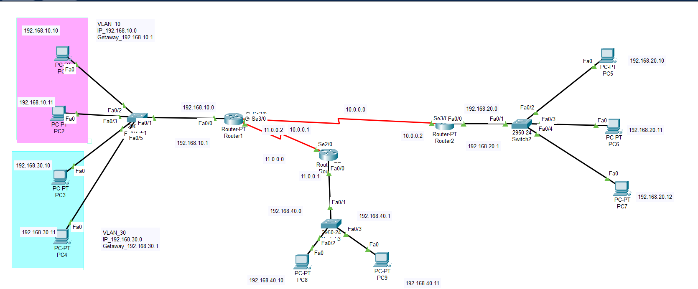

#  Enterprise Network Design

## Overview

This project presents the design and implementation of a secure and scalable enterprise network using Cisco Packet Tracer. The network was developed for a company environment with multiple departments, focusing on efficient communication, logical segmentation, and secure access between different areas of the organization.

The project demonstrates practical networking concepts including routing, switching, VLAN implementation, IP addressing, and access control while following standard enterprise network design principles.

---

## Project Objectives

- Design a scalable enterprise network.
- Connect multiple departments through a structured topology.
- Implement logical network segmentation using VLANs.
- Enable communication between different network segments.
- Improve network organization and manageability.
- Apply security policies to control network access.
- Demonstrate practical Cisco networking skills using Packet Tracer.

---

# Network Topology

---

## Project Features

- Enterprise network architecture
- Multi-router topology
- Multiple Cisco switches
- Department-based VLAN segmentation
- IPv4 addressing plan
- Inter-network communication
- Access Control Lists (ACL)
- Cisco IOS CLI configuration
- End-to-end connectivity testing

---

## Technologies Used

- Cisco Packet Tracer
- Cisco Routers
- Cisco Switches
- IPv4 Addressing
- VLANs
- Static & Dynamic Routing
- Access Control Lists (ACL)
- Cisco IOS CLI

---

## Network Design Highlights

The network was designed following enterprise networking principles by separating departments into different logical segments while maintaining secure communication between authorized devices.

The implementation includes:

- Structured IP addressing
- Router and switch configuration
- VLAN implementation
- Routing configuration
- Network segmentation
- Access control policies
- Connectivity verification
- End-device communication testing

---

## Skills Demonstrated

- Enterprise Network Design
- Network Planning
- IPv4 Address Planning
- Cisco Router Configuration
- Cisco Switch Configuration
- VLAN Deployment
- Routing Configuration
- Network Security Fundamentals
- ACL Configuration
- Network Troubleshooting
- Cisco IOS Command Line

---

## Learning Outcomes

Through this project, the following practical networking skills were developed:

- Designing enterprise-scale network topologies.
- Configuring Cisco routers and switches.
- Building segmented networks using VLANs.
- Implementing routing between multiple networks.
- Applying basic security using Access Control Lists.
- Testing and troubleshooting network connectivity.
- Documenting and organizing networking projects professionally.

---

## Future Improvements

Possible future enhancements include:

- OSPF Multi-Area Routing
- DHCP Server Integration
- NAT/PAT Configuration
- IPv6 Deployment
- SSH Remote Management
- Port Security
- EtherChannel
- High Availability (HSRP)
- Network Monitoring

---

## Repository Contents

- Cisco Packet Tracer project (.pkt)
- Network topology diagram
- Project documentation
- Configuration files

---

## Author

Sultanah Aljohani

Computer Engineering Student

Interested in Networking, Cloud Computing, and Enterprise Infrastructure.
